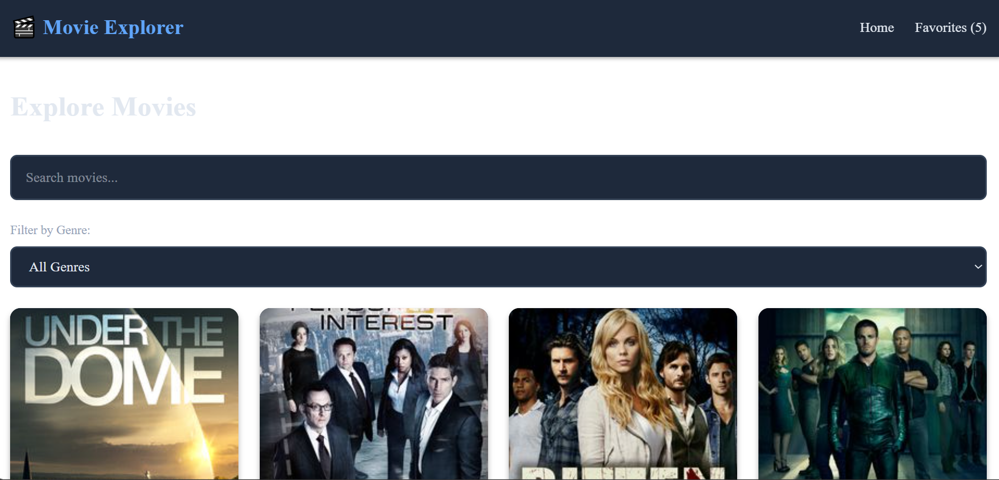
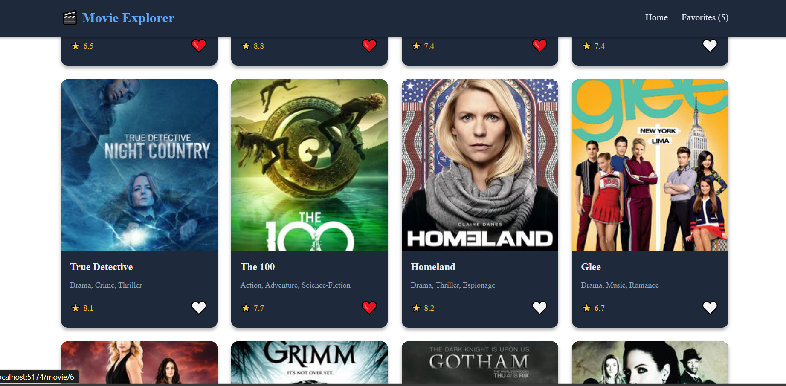
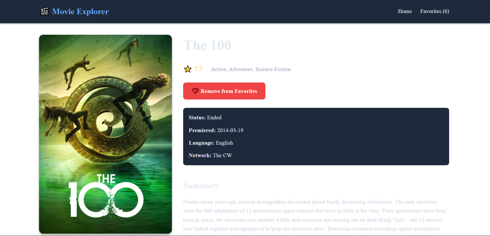

# 🎬 Movie Explorer

A single-page application (SPA) built with React and Vite that allows users to explore movies, search, filter by genre, and manage favorites.

## ✨ Features

- **Browse Movies**: View a comprehensive list of TV shows from TVMaze API
- **Search**: Real-time search functionality to find movies by name
- **Filter by Genre**: Filter movies by different genres/categories
- **Movie Details**: View detailed information about each movie
- **Favorites**: Add/remove movies to favorites with localStorage persistence
- **Responsive Design**: Works seamlessly on desktop and mobile devices
- **Routing**: Navigate between Home, Movie Details, and Favorites pages

## 🛠️ Technologies

- **React 18** - UI library
- **Vite** - Build tool and dev server
- **React Router v6** - Client-side routing
- **TVMaze API** - Movie data source
- **localStorage** - Favorites persistence
- **Custom Hooks** - Reusable logic (useFetchMovies, useFavorites)

## 📁 Project Structure

---
/src
  /components
    Navbar.jsx          # Navigation bar with favorites count
    MovieCard.jsx       # Reusable movie card component
    SearchBar.jsx       # Search input component
    CategoryFilter.jsx  # Genre filter dropdown
  /pages
    Home.jsx           # Main page with movie list
    MovieDetails.jsx   # Individual movie details page
    Favorites.jsx      # Favorites collection page
  /hooks
    useFetchMovies.js  # Custom hook for fetching movies
    useFavorites.js    # Custom hook for managing favorites
  /utils
    api.js             # API utility functions
  App.jsx              # Main app component with routing
  main.jsx             # Entry point
---

## 🎯 Usage

1. **Browse Movies**: The home page displays all available movies
2. **Search**: Type in the search bar to filter movies by name
3. **Filter**: Select a genre from the dropdown to filter movies
4. **View Details**: Click on any movie card to see full details
5. **Add to Favorites**: Click the heart icon to add/remove from favorites
6. **View Favorites**: Navigate to the Favorites page to see your collection

## 🌐 Live Demo

[
https://vercel.com/new/ualine055-5515s-projects/success?developer-id=&external-id=&redirect-url=&branch=main&deploymentUrl=react-movie-explorer-375nbnir2-ualine055-5515s-projects.vercel.app&projectName=react-movie-explorer&s=https%3A%2F%2Fgithub.com%2FUaline055%2Freact-movie-explorer&gitOrgLimit=&hasTrialAvailable=1&totalProjects=1&flow-id=pAsvgaBYleHciVekAMld9
]

## github repository link

[https://github.com/Ualine055/react-movie-explorer.git]

## 📸 Screenshots

[

]

